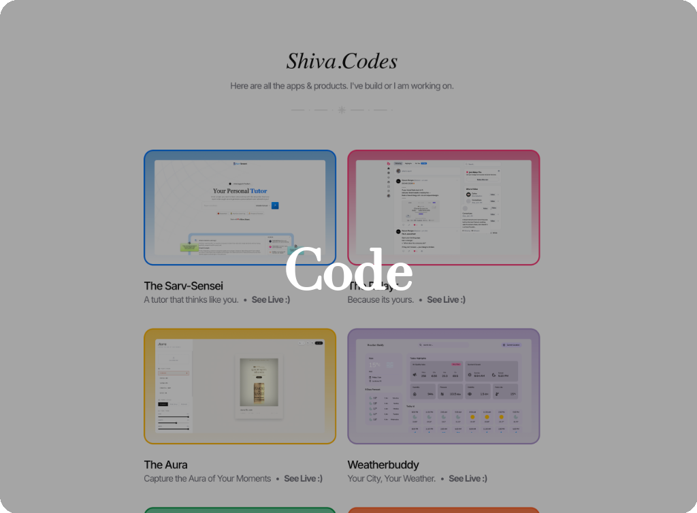
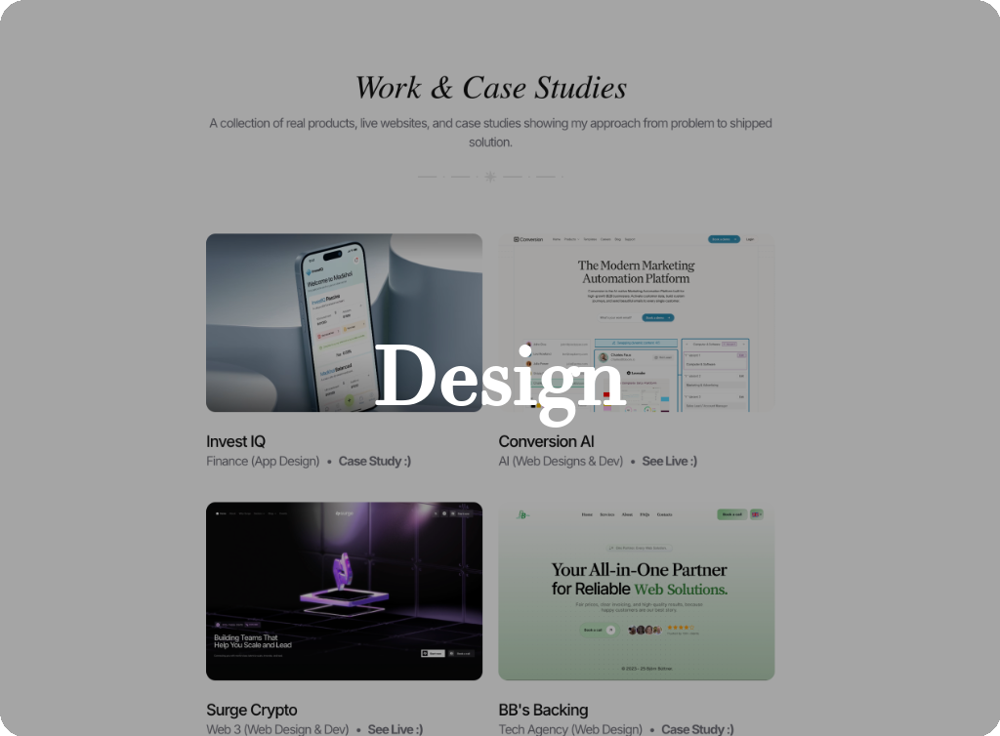
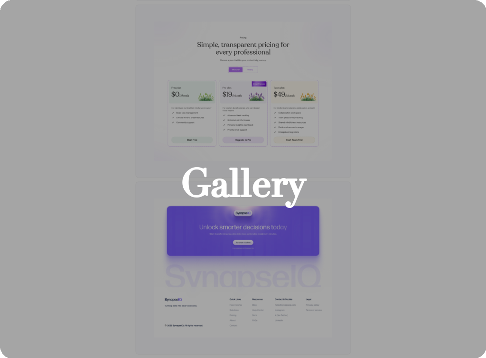
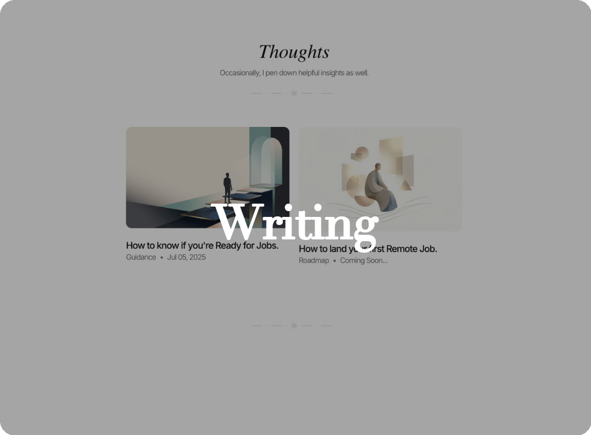

<!-- Name & Title -->

  

 

  <picture>
    <source media="(prefers-color-scheme: dark)" srcset="https://readme-typing-svg.demolab.com?font=Playfair+Display&weight=800&size=42&duration=500&pause=1000000&color=FFFFFF&center=true&vCenter=true&width=500&lines=Shiva+Bajpai">
    <source media="(prefers-color-scheme: light)" srcset="https://readme-typing-svg.demolab.com?font=Playfair+Display&weight=800&size=42&duration=500&pause=1000000&color=000000&center=true&vCenter=true&width=500&lines=Shiva+Bajpai">
    
  </picture>
  

---

### ✦ The Pulse
I build products. Mostly web things.  
I design them, write the code, and try to make sure they don’t break as they grow.  
I like keeping things simple and usable.  

> **Right now:** Working on [Sarvagya AI](https://axiv.in) to build an AI powerhouse and building premium web interfaces through [Elysium](https://elysiumdesigns.in).

---

### Celebrate the small, they lead to the big.

#### :) The Career Arc
*   **Founder @ [Elysium Designs](https://elysiumdesigns.in) · [Sarvagya AI](https://axiv.in) · DropHaus · Next Level**: Mostly building. Occasionally sleeping.
*   **Completed multiple internships and freelance projects** from the very first year of college.
*   **Secured a full-time UI/UX role** inbound—the offer came to me, based solely on my proof of work.
*   **Designed & Built 100+ websites, apps, and SaaS products** with my agency with great client satisfaction & loved by users globally.
*   **Some of the teams I’ve shipped work for:** [CGI (formerly Logica)](https://cgi.com) · [High Flyers](https://www.highflyers.ai/) · [Unstuck](https://unstuckstudy.com/) · [Active Hop](https://www.active-hop.com/) · [Spot AI](https://www.spot.ai/) · **REX** · [Factory AI](https://factory.ai/) · [Lucent Digital](https://lucentdigital.in/) · [Acumenn](https://acumenn.io/) · [Quizard AI](https://usequizard.com/) · [a0.dev](http://a0.dev/) · **BB's Backing** · **Value Properties** + more.

#### :) Technical Dominance
*   **Top 15% on LeetCode**: | **750+ Problems Solved** | **Max Rating: 1748.**
*   **National Rank 27th** in Ninja SlayGround 2.0 (National Competition).
*   **Contributed to CNCF, GSSoC, SWoC, JGEC & Hacktoberfest'24,'25.**
*   **Mentored across GSSoC & Hacktoberfest,** fostering the next wave of builders.

---

### :) Vision & Global Footprint
*   **OXML’24 Summer Student** (Mastering Generative AI).
*   **Got selected as Top 100 Students Globally** for HPAIR’24 by Harvard University.
*   **Got Selected as Google Campus Ambassador** to lead the developers group in the college.

---

### :) The Showcase ⚡️

  <table align="center" border="0" cellspacing="15">
    <tr>
      <td width="50%" align="center">
        
      </td>
      <td width="50%" align="center">
        
      </td>
    </tr>
    <tr>
      <td width="50%" align="center">
        
      </td>
      <td width="50%" align="center">
        
      </td>
    </tr>
  </table>

---

### :) What I’m Working On

| Productse | Description | Status |
|---------|-------------|--------|
| **[Elysium Designs](https://elysiumdesigns.in)** | Premium digital agency crafting world-class digital experiences—web, app, branding, and motion. | *Scaling* |
| **[Sarvagya AI](https://axiv.in)** | The ultimate AI ecosystem empowering students & creators with learning tools and automation. | *Active Development* |
| **[DropHaus](https://drophaus.in)** | A library of ready-to-use design components and templates for faster product building. | *Active Development* |
| **Next Level** | A platform to elevate personal brands, skills, and career growth opportunities. | *Vision Phase* |

### :) Global Impact & Velocity

  
  

  

---

### :) Connect with me

  <a href="https://www.linkedin.com/in/shiva-bajpai-sb06/"><b>LinkedIn</b></a> • 
  <a href="https://peerlist.io/shivabajpai"><b>Peerlist</b></a> • 
  <a href="https://x.com/sb__codes"><b>X</b></a> • 
  <a href="https://leetcode.com/sb__codes"><b>LeetCode</b></a> • 
  <a href="https://behance.net/shivabajpai"><b>Behance</b></a> • 
  <a href="https://instagram.com/_shiva__bajpai_"><b>Instagram</b></a> • 
  <a href="https://dribbble.com/shivabajpai"><b>Dribbble</b></a>

---

  <a href="https://shivabajpai.in">still building :)</a>

  

